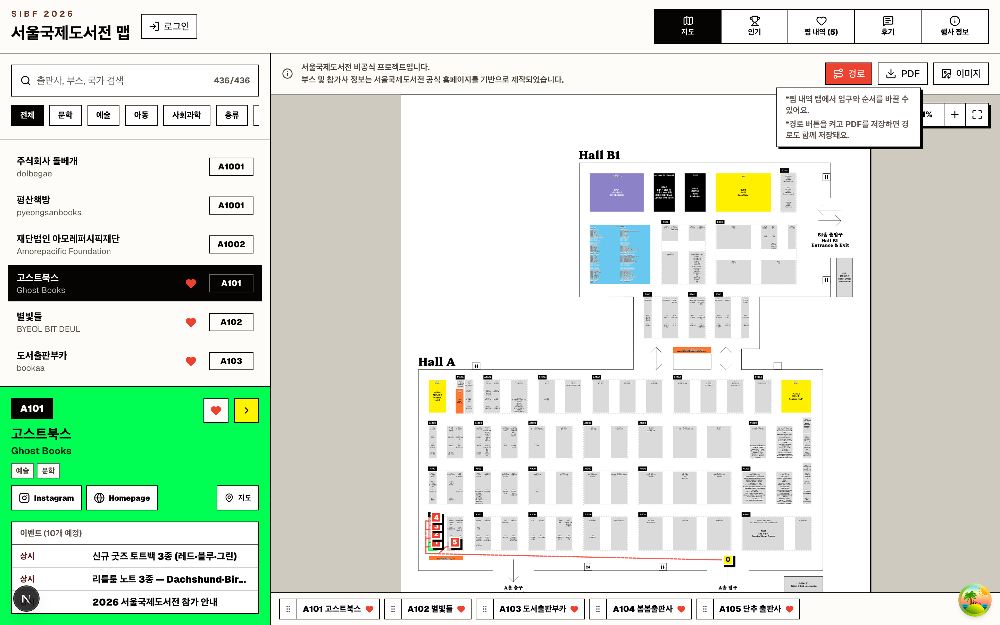
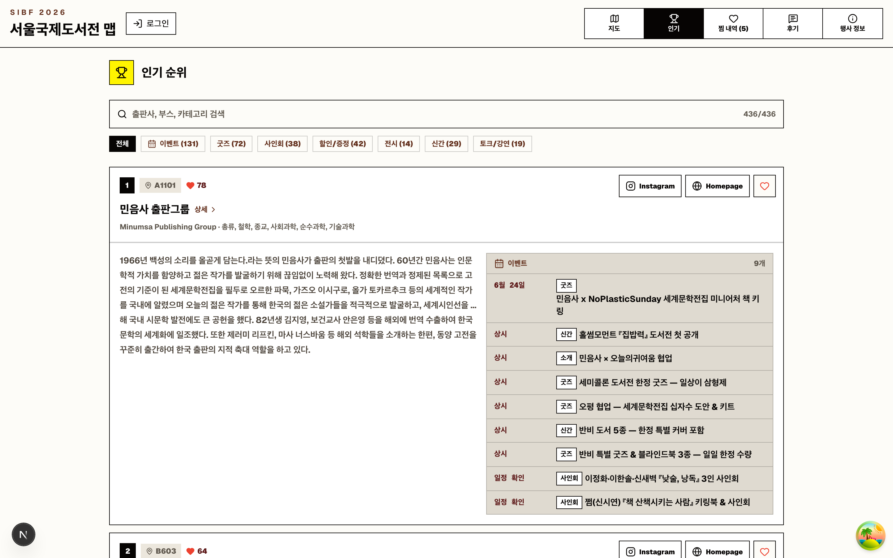
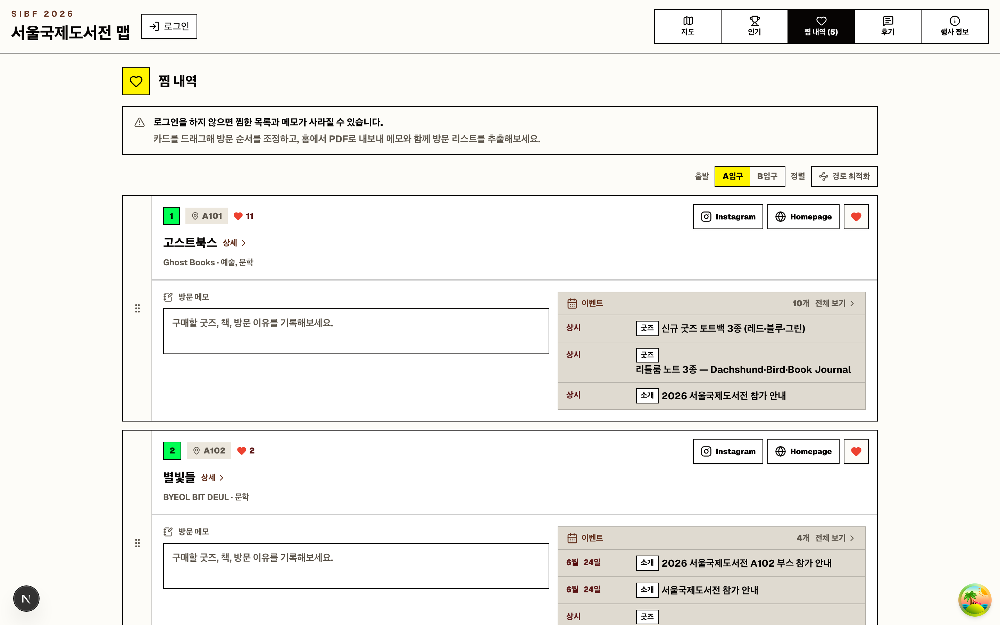
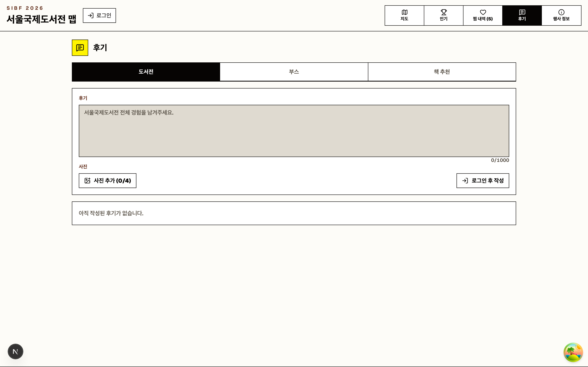
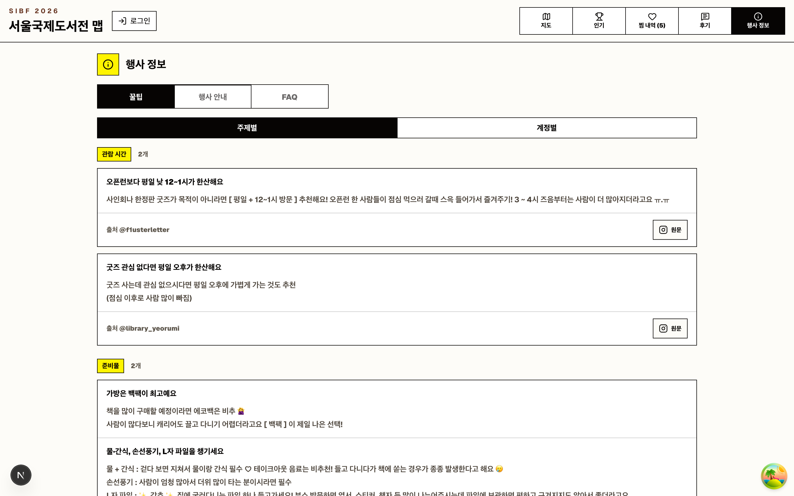
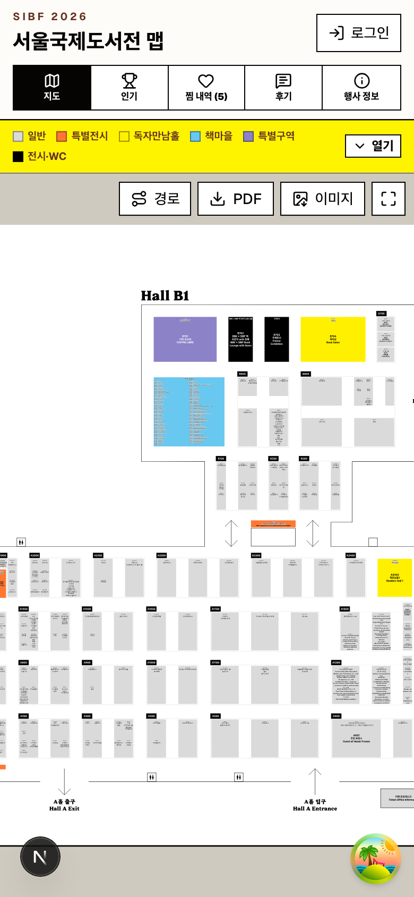
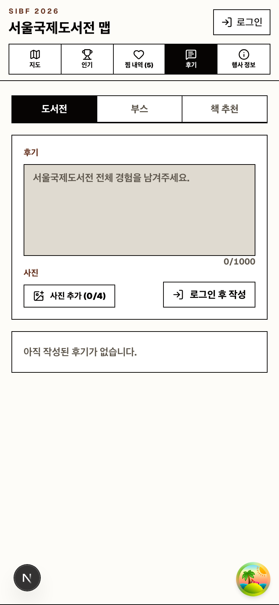

# 2026 서울국제도서전 인터랙티브 맵

**2026 서울국제도서전(SIBF)** 을 더 알차게 둘러보기 위한 웹 앱입니다.
COEX A·B1홀 도면 위에서 부스를 찾고, 마음에 드는 출판사를 찜하고, 최적 동선으로 정리하고, 후기를 남길 수 있습니다.

> ⚠️ **비공식 프로젝트**입니다. 부스·참여사 정보는 [서울국제도서전 공식 홈페이지(sibf.kr)](https://sibf.kr) 데이터를 기반으로 제작되었습니다.

<p align="center">
  
</p>

<p align="center">
  <a href="https://www.instagram.com/reel/DZxLZBTBWfi/">▶︎ 홍보 영상 보기 (Instagram Reels)</a>
</p>

---

## 만든 계기

공식 서울국제도서전 사이트의 지도는 정보를 한눈에 파악하기 어려웠습니다.
**부스를 하나씩 클릭해야만 해당 부스 정보가 뜨는 구조**라, 어떤 출판사가 어디에 있는지 훑어보거나 미리 동선을 짜기가 번거로웠습니다.

그래서 **검색·필터로 참여사를 바로 찾고, 찜한 부스를 최적 동선으로 정리하고, 인기·후기까지 한 화면에서 둘러볼 수 있는** 지도를 직접 만들었습니다.

---

## 주요 기능

앱은 상단 네비게이션의 **5개 탭**으로 구성됩니다 — 지도 / 인기 / 찜 내역 / 후기 / 행사 정보.

### 지도 — `/`

COEX Hall A·B1 도면(SVG) 위에 부스를 오버레이한 핵심 인터랙티브 지도입니다.

- **자유로운 이동/확대** — 마우스 드래그 팬, 휠 줌(커서 기준), 모바일 핀치 줌·드래그. 줌 컨트롤(−/＋, 배율%)과 화면 맞춤 버튼 제공.
- **검색 & 카테고리 필터** — 출판사명·부스·국가로 검색(실시간 매칭 수), 상위 카테고리 칩으로 필터링.
- **부스 상세 패널** — 부스 코드·국문/영문명·카테고리, Instagram·홈페이지 링크, 예정 이벤트, **같은 부스의 다른 참여사**로 바로 이동.
- **찜 & 드래그 정렬** — 하트로 찜하고, 하단 찜 바에서 칩을 드래그해 순서 변경(클릭 시 해당 부스로 지도 이동).
- **경로 오버레이** — 찜한 부스들을 입구(A/B)에서 시작하는 방문 순서로 이어 A\* 기반 경로를 그리고 번호 뱃지 표시.
- **PDF / PNG 내보내기** — 지도·경로·찜 목록·방문 메모를 PDF로 저장하거나, 도면 전체를 PNG 이미지로 저장.
- **존 범례** — 일반/특별전시/독자만남홀/책마을/특별구역 색상 안내.

### 인기 — `/popular`



- **찜 수 기준 랭킹** — 참여사를 찜 수로 정렬해 순위 뱃지와 함께 표시.
- **검색 & 이벤트 필터** — 출판사·부스·카테고리 검색, 이벤트 종류(굿즈/사인회/할인·증정/전시/신간/토크·강연) 칩 필터(각 개수 표시).
- **URL 상태 동기화** — 검색어·필터가 쿼리스트링에 반영되어 뒤로 가기로 상태 복원.

### 찜 내역 — `/route`



찜한 부스를 방문 계획으로 정리하는 화면입니다. (탭 라벨에 찜 개수 뱃지 표시)

- **방문 순서 드래그 정렬** — 세로 리스트를 드래그해 순서 조정(지도 경로와 공유).
- **방문 메모** — 부스별 메모 작성(자동 저장).
- **입구 선택 & 경로 최적화** — A/B 입구 선택 후 최단 방문 순서로 자동 재정렬(되돌리기 지원).

### 후기 — `/reviews`



- **3가지 스코프** — 도서전 전체 / 부스 / 책 추천, 각 탭에 실시간 개수 표시.
- **작성 폼** — 스코프별 입력(부스 선택, 책 제목·저자 등), 글자 수 카운터(최대 1000자), **사진 첨부**.
- **피드 & 라이트박스** — 작성자·시간·사진 썸네일(전체화면 보기), 본인 글 삭제.
- **Google 로그인** 후 작성 가능(로그아웃 상태에서는 "로그인 후 작성" 안내).

### 행사 정보 — `/info`



- **꿀팁** — 방문 팁을 **주제별 / 계정별** 토글로 열람(출처 Instagram 링크 포함).
- **행사 안내** — 기간·장소·주제·주빈국 안내, 포스터, 운영 시간, **온라인 티켓 표**(오늘 날짜 기준 판매 상태 자동 표시), 주요 전시 프로그램.
- **FAQ** — 카테고리·질문·답변 통합 검색(실시간 결과 수).

### 반응형 & 공통

<p align="center">
  
  &nbsp;&nbsp;
  
</p>

- **모바일 최적화** — 지도의 드래그 스냅 바텀시트, 모바일 전용 액션 버튼, 뷰포트 높이 보정.
- **인증** — Supabase 기반 Google OAuth. 로그인 시 찜/메모를 서버에 영속화하여 기기 간 동기화.
- **찜 시스템** — `localStorage` 저장 + 커스텀 이벤트로 탭 간 실시간 동기화, 익명 공용 찜 수 집계.
- **참여사 상세 페이지** — `/publishers/[no]` 에서 프로필·이벤트·링크·스코프별 후기 제공.
- **디자인** — 네오브루탈 테마(굵은 타이포·각진 테두리), `sonner` 토스트 알림.

---

## 기술 스택

- **프레임워크** — Next.js 16.2.4 (App Router, Turbopack) · React 19.2.3 · TypeScript 5
- **스타일** — Tailwind CSS v4 (config 파일 없이 `globals.css`의 `@theme` 토큰) · shadcn/ui (new-york) · next-themes
- **상태/데이터** — TanStack Query · `useSyncExternalStore` + localStorage · dnd-kit(드래그 정렬)
- **백엔드** — Supabase (`@supabase/ssr`) — 인증·후기·찜 수·참여사/이벤트 데이터
- **내보내기** — jspdf(PDF) · html-to-image(PNG) · browser-image-compression(사진 업로드)
- **테스트/문서** — Storybook 10 · Vitest 4 (Playwright 브라우저 모드)
- **패키지 매니저** — pnpm

---

## 데이터

- **부스 213개 / 참여사 436개** — `src/data/sibf-2026-floor-*.json` (도면 좌표 + 참여사 목록).
  - **부스**(`boothNumber`, 도면 사각형)와 **참여사**(`booth`, 참여 기업)는 별개 개념 — 한 부스에 여러 참여사가 들어갈 수 있습니다.
- **FAQ 19건 · 꿀팁 7건** — 루트 `data/*.json`.
- **도면·포스터** — `public/data/sibf-2026-floor-plan.svg`, `sibf-2026-poster.png`.
- **동적 데이터** — 참여사 상세·이벤트·찜 수·후기는 Supabase(`publishers`, `publisher_events` 테이블 + RPC)에서 로드.

---

## 시작하기

```bash
pnpm install

# Supabase 환경 변수 설정 (.env.example 참고)
cp .env.example .env.local
#   NEXT_PUBLIC_SUPABASE_URL=...
#   NEXT_PUBLIC_SUPABASE_PUBLISHABLE_KEY=...

pnpm dev            # http://localhost:3000
```

자주 쓰는 스크립트:

| 커맨드                | 설명                                     |
| --------------------- | ---------------------------------------- |
| `pnpm dev`            | 개발 서버 (localhost:3000)               |
| `pnpm build`          | 프로덕션 빌드                            |
| `pnpm lint`           | ESLint                                   |
| `pnpm test`           | Vitest (Storybook 브라우저 모드)         |
| `pnpm storybook`      | Storybook (port 6006)                    |
| `npx tsc --noEmit`    | 타입 검사                                |

---

## 프로젝트 구조 (핵심만)

```
src/
├── app/
│   └── (fair)/                  # 라우트 그룹 (URL 세그먼트 없음)
│       ├── _lib/tabs.ts         # 탭 정의 (단일 소스)
│       ├── page.tsx             # / → 지도
│       ├── popular/ · route/ · reviews/ · info/
│       └── publishers/[publisherNo]/   # 참여사 상세
├── components/
│   ├── fair-map/                # 지도 도메인 (book-fair-map.tsx, map-data.ts, use-favorites.ts …)
│   ├── auth/                    # Supabase 인증 UI
│   └── ui/                      # shadcn (직접 수정 금지)
├── api/fair-map/                # Supabase 서버 데이터 조회
├── lib/supabase/                # 브라우저/서버 클라이언트
└── data/                        # 부스·참여사·FAQ·팁 JSON

public/data/                     # 플로어플랜 SVG · 포스터 PNG
```

프로젝트 컨벤션과 도메인 규약은 [`.claude/CLAUDE.md`](./.claude/CLAUDE.md)에 정리되어 있습니다.

---

## 라이선스 / 출처

개인 학습·편의용 **비공식** 프로젝트입니다. 모든 행사·부스·참여사 정보의 저작권은 [서울국제도서전(sibf.kr)](https://sibf.kr)에 있습니다.
